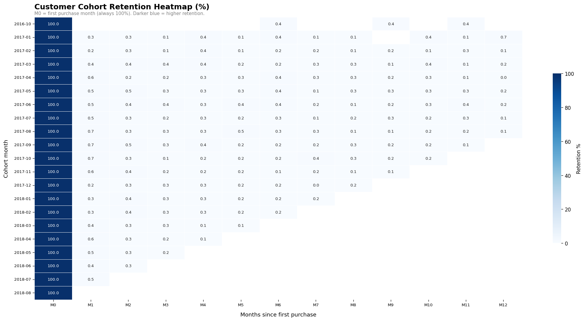

# Olist Customer Cohort Analysis

> **Tools:** Google BigQuery · Python 3 (pandas, seaborn, matplotlib, sklearn) · Google Colab  
> **Dataset:** [Olist Brazilian E-Commerce Public Dataset](https://www.kaggle.com/datasets/olistbr/brazilian-ecommerce) (Kaggle)

---

## Business Problem

What is the customer retention profile of a Brazilian e-commerce platform — and what 
drives (or prevents) repeat purchase behaviour?

---

## Key Findings

| Metric | Value |
|--------|-------|
| Overall churn rate | **96.4%** — 96 in 100 customers never return |
| Median days to 2nd purchase | **29 days** — the re-engagement window |
| Repeat buyer revenue share | **5.6%** — 3% of customers, outsized revenue |
| Peak acquisition month | **Nov 2017** — 7,060 new customers |
| Platinum tier revenue share | **59.4%** — top 25% drive most revenue |
| Logistic regression AUC | **0.690** — spend quartile strongest protective factor |

---

## Cohort Retention Heatmap

*Month 0 = first purchase month (always 100%). Darker blue = higher retention.*

---

## Project Structure
1. sql/                  # BigQuery SQL — cleaning, cohort creation, KPIs
2. notebooks/            # Python (Colab) — all 11 charts
3. charts/               # Exported chart PNGs (Figures 1–11)
4. report/               # Full PDF report (19 pages)

## Analysis Sections

1. **Retention** — cohort heatmap + retention curves (Figures 1–2)
2. **Churn & Acquisition** — stacked bar churn + dual-axis acquisition (Figures 3–4)
3. **Predictive Modelling** — logistic regression ROC, feature importance, confusion matrix (Figure 5)
4. **Revenue & Repurchase** — revenue split donut + repurchase window (Figures 6–7)
5. **Segmentation** — NTILE spend quartiles Bronze→Platinum + seasonal comparison (Figures 8–9)
6. **Geographic** — Brazil choropleth, repeat rate by state (Figure 10)
7. **Payment** — payment method distribution + cohort trend (Figure 11)

## How to Reproduce

1. Download the Olist dataset from Kaggle (link above)
2. Upload all 9 CSVs to BigQuery under dataset `olist_raw`
3. Run SQL files in order: `01` → `02` → `03` → `04` → `05`
4. Export KPI query results as CSVs
5. Upload CSVs to Google Colab and run `notebooks/olist_cohort_charts.ipynb`

## Full Report

[View Full Report (PDF)](report/Olist_Cohort_Analysis_MansiKumari.pdf)

---

*Feedback and questions welcome via GitHub Issues.*
